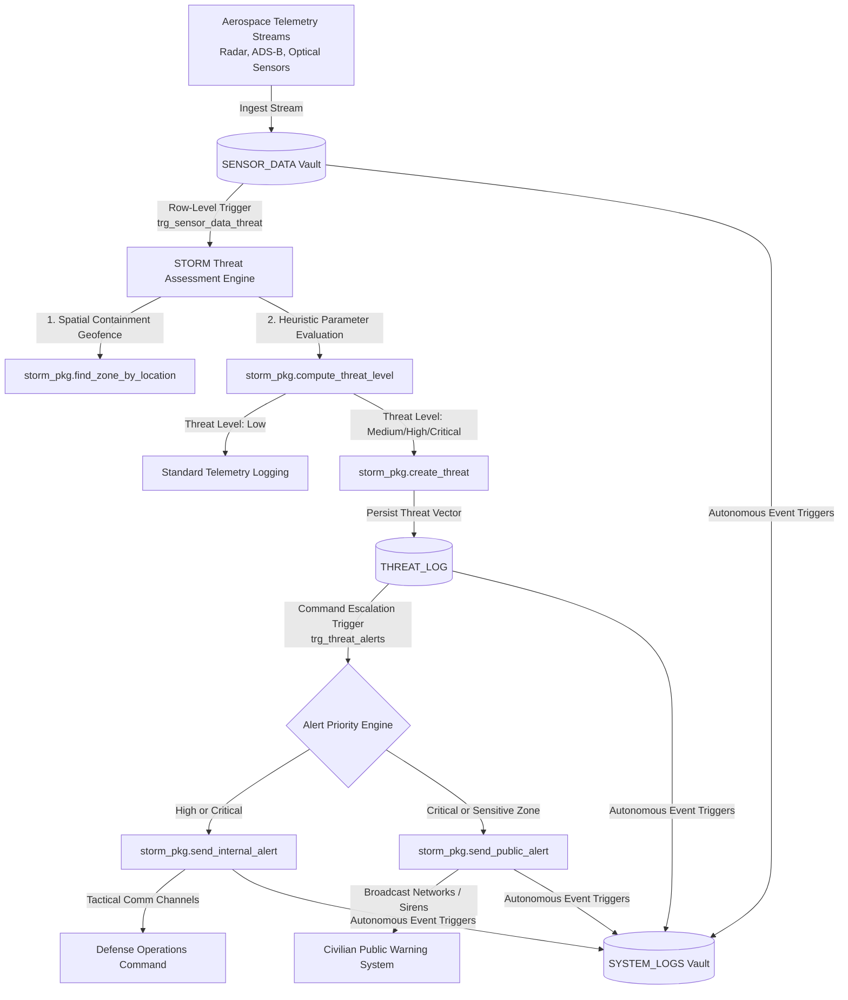

# S.T.O.R.M. — Spatial Threat Observation & Rapid Mitigation

## Tactical Airspace Command & Control (C4ISR) Database Engine

[](#)
[](#)
[](#)

**Spatial Threat Observation & Rapid Mitigation (S.T.O.R.M.)** is an enterprise-grade, database-driven C4ISR (Command, Control, Communications, Computers, Intelligence, Surveillance, and Reconnaissance) engine. It is engineered to process high-throughput aerospace telemetry streams, automate heuristic-based threat assessment, identify perimeter violations via geofencing, and orchestrate real-time defensive countermeasures and public safety warnings.

Designed with native Oracle PL/SQL database constructs, the system delivers ultra-low-latency processing, robust data containment, strict temporal access controls, and tamper-resistant security logging.

---

## 🛰️ Operational System Architecture & Telemetry Pipeline

The S.T.O.R.M. engine utilizes a reactive event-driven pipeline where incoming sensor data immediately initiates spatial analysis, threat scoring, and command escalation. 



---

## ⚡ Core Operational Capabilities

### 1. Ingestion & High-Frequency Telemetry
The interface processes raw, multi-sensor aerospace telemetry into the `SENSOR_DATA` segment. Each record ingests parameters including geodetic positioning (latitude/longitude), absolute altitude (feet), airspeed (knots), flight heading, transponder squawk status, and automated callsign resolution.

### 2. Spatial Geofencing & Boundary Containment
Leveraging mathematical geofencing heuristics via `storm_pkg.find_zone_by_location`, the system matches real-time target vectors against coordinate-mapped restricted zones (`ZONE`) in a single pass, immediately alerting if targets cross into sensitive or prohibited air sectors.

### 3. Automated Threat Assessment Engine
Non-cooperative targets are assessed against intelligence threat parameters. The engine (`storm_pkg.compute_threat_level`) dynamically scores threat classifications (**Low**, **Medium**, **High**, **Critical**) by evaluating:
* **Cooperative Signaling**: Missing or deactivated transponder signals.
* **Flight Profile**: Speed anomalies relative to commercial envelopes, steep glide paths, or unauthorized low-altitude operation.
* **Spatial Intersection**: Proximity to critical state infrastructure or restricted military corridors.

### 4. Command Escalation Protocols (Alerting)
Dual-tier triggers automate threat mitigation response:
* **Tactical Escalation**: High/Critical threats generate secure event payloads dispatched to Defense Operations (`DEFENSE_OPERATIONS`) or analytical cells (`ANALYSIS_TEAM`).
* **Civilian Alert System**: Critical airspace violations in inhabited or protected zones trigger immediate public alert pipelines simulating local sirens, broadcast over-the-air signals, and emergency notification broadcasts.

---

## 🛡️ Enterprise Security & Database Hardening

To support mission-critical integrity, S.T.O.R.M. implements strict database-level security policies and administrative controls:

### 📑 Comprehensive Autonomous Auditing
* **Centralized Tracking**: `SYSTEM_LOGS` archives all structural and operational DML events.
* **After-Action Triggers**: Every record creation, update, or deletion across critical tables (e.g. `OPERATORS`, `AIRCRAFT`, `SENSORS`) writes to the audit vault using a centralized auditing interface (`ADD_LOG`).
* **Non-Repudiation**: Key security logging processes run inside an `AUTONOMOUS_TRANSACTION` block to ensure records are permanently committed even if the parent business transaction is subsequently aborted or rolled back.

### 🔒 Operational Access Control & Lockout
* **Temporal Guardrails**: The database enforces strict operating windows through time-lock procedures (`IS_RESTRICTED_PERIOD`). Unauthorized configuration modifications to critical tables (`AIRCRAFT`, `SENSORS`, `OPERATORS`, `ZONE`) are prohibited during restricted hours (e.g. out-of-hours weekday operations or national holiday intervals).
* **Defensive Error Escalation**: Prohibited transactions are immediately terminated, raising database exception `RAISE_APPLICATION_ERROR (-20041)` while automatically recording the violation and metadata inside the secure audit system.

---

## ⚙️ Physical & Logical Storage Topology

S.T.O.R.M. segregates operations into discrete physical database tablespaces to ensure extreme system performance, simplify administrative isolation, and optimize physical I/O workloads:

| Tablespace | Target Data Segments | Rationale |
| :--- | :--- | :--- |
| **`STORM_DATA`** | Core relational tables: `SENSOR_DATA`, `THREAT_LOG`, `ALERTS`, etc. | Segregates primary system records for streamlined backup schedules and raw data I/O optimization. |
| **`STORM_INDEX`** | Primary keys, composite constraints, and search indexes. | Eliminates disk head contention by separating relational tablespace scans from index lookup sectors. |
| **`STORM_TEMP`** | Transient memory sectors for sorting, hash joins, and bulk queries. | Dedicated temp allocation to prevent system degradation during high-throughput analytic operations. |

### Database Memory Management
The system configuration employs Oracle Automatic Memory Management (AMM) to dynamically distribute resources between the System Global Area (SGA) and Program Global Area (PGA) under load:
```sql
ALTER SYSTEM SET memory_target = 3G SCOPE=SPFILE;
ALTER SYSTEM SET memory_max_target = 3G SCOPE=SPFILE;
```

---

## 📂 System File & Component Map

The repository is modularly structured to divide physical configuration, procedural business logic, security restrictions, and command metrics:

* 🛡️ **[Audits & Restrictions](file:///d:/projects/S.T.O.R.M/Audits%20&%20Restrictions/README.md)**  
  Contains `AUDIT.sql` (auditing framework) and `RESTRICTIONS.sql` (temporal security lockouts).
* ⚙️ **[Database Engine Scripts](file:///d:/projects/S.T.O.R.M/database/README.md)**  
  Houses relational creation scripts, package engines, recursive triggers, automated clean-up scheduler jobs, and validation suites.
* 📋 **[ERD & Data Dictionary](file:///d:/projects/S.T.O.R.M/ERD&Data_Dictionary/README.md)**  
  Logical schema structures, entity-relationship diagrams, and column-level definitions.
* 💾 **[Database Configuration Topology](file:///d:/projects/S.T.O.R.M/DB_Conf/README.md)**  
  Physical tablespace provisioning parameters and backup archivelog configurations.
* 📊 **[Tactical BI Dashboards](file:///d:/projects/S.T.O.R.M/BI%20&%20Analytics/README.md)**  
  Analytical tracking models and command-center visual dashboards.
* 🗺️ **[BPMN Process Mapping](file:///d:/projects/S.T.O.R.M/BPMN/README.md)**  
  Standardized tactical business process modeling workflows mapping system operations.

---

## 🛠️ Environment Provisioning (SOP)

Follow this Standard Operating Procedure to deploy the S.T.O.R.M. core engine:

1. **Secure Environment Access**
   Establish a secure connection to your Oracle Database instance using an administrative shell or Oracle SQL Developer.
2. **Execute System Configuration (Admin)**
   Provision physical tablespaces and enable backup logging prior to schema load:
   * Execute [01-Tablespace_conf.sql](file:///d:/projects/S.T.O.R.M/DB_Conf/01-Tablespace_conf.sql)
3. **Deploy Schema Framework & Engine**
   Navigate to the `database/scripts` directory and run the compilation packages in order:
   * [01-CREATE.sql](file:///d:/projects/S.T.O.R.M/database/scripts/01-CREATE.sql) (Relational Tables & Sequences)
   * [07-PACKAGES.sql](file:///d:/projects/S.T.O.R.M/database/scripts/07-PACKAGES.sql) (Core S.T.O.R.M. Intelligence Rules Package)
   * [08-TRIGGERS.sql](file:///d:/projects/S.T.O.R.M/database/scripts/08-TRIGGERS.sql) (Operational Event Pipeline Triggers)
   * [09-SCHEDULER JOB.sql](file:///d:/projects/S.T.O.R.M/database/scripts/09-SCHEDULER%20JOB.sql) (Automated Cleanup Engine)
4. **Deploy Audits and Security Lockdown Policies**
   Compile auditing pipelines and time-lock triggers:
   * [AUDIT.sql](file:///d:/projects/S.T.O.R.M/Audits%20&%20Restrictions/AUDIT.sql) (Audit Trail Architecture)
   * [RESTRICTIONS.sql](file:///d:/projects/S.T.O.R.M/Audits%20&%20Restrictions/RESTRICTIONS.sql) (Lockdown Constraints)
5. **Populate Reference Data**
   Apply bootstrap telemetry and sensor data vectors:
   * Runs scripts `02-INSERT (AIRCRAFT).sql` through `06-INSERT (ZONE).sql`.
6. **Execute Diagnostic & Live Fire Simulations**
   * Enable diagnostic telemetry: `SET SERVEROUTPUT ON;`
   * Run the test suite: [10-testing.sql](file:///d:/projects/S.T.O.R.M/database/scripts/10-testing.sql) to simulate target interceptions and review reactive alarms.

---

## ⚖️ Security Classification & Proprietary Notice

> [!CAUTION]
> **RESTRICTED INFORMATION**
> This repository contains proprietary technology and blueprints for the S.T.O.R.M. aerospace defense system. Unauthorized retrieval, replication, distribution, or reverse engineering of this system is strictly prohibited and subject to severe prosecution.
> 
> *All operational scripts, procedural models, and spatial schemas are proprietary artifacts of the development agency.*
